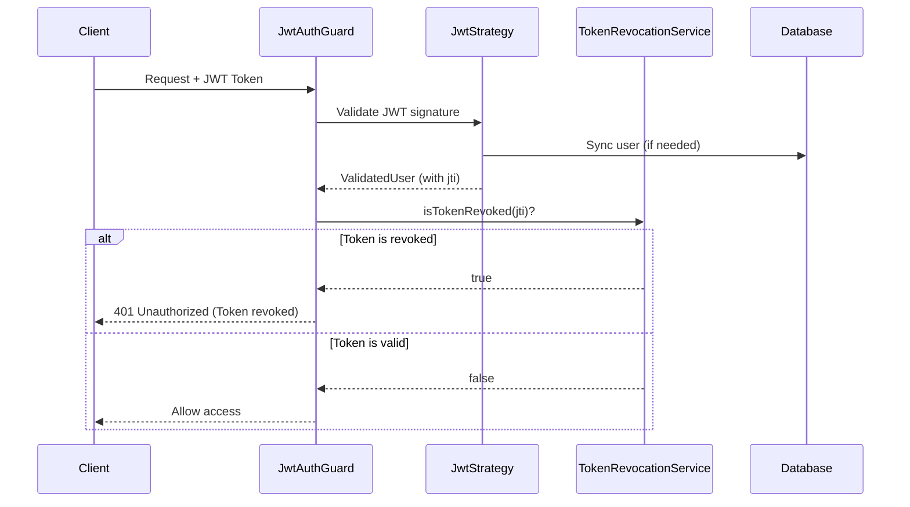

# Token Revocation

Este documento describe el sistema de revocación de tokens JWT implementado en Context.ai API para permitir logout inmediato y gestión de tokens comprometidos.

## 📋 Tabla de Contenidos

- [Overview](#overview)
- [Arquitectura](#arquitectura)
- [Cómo Funciona](#cómo-funciona)
- [Uso](#uso)
- [Limitaciones y Consideraciones](#limitaciones-y-consideraciones)
- [Para Producción](#para-producción)

---

## Overview

**Problema**: Con JWT stateless, los tokens siguen siendo válidos hasta que expiran naturalmente, incluso después de que un usuario cierra sesión o si el token es comprometido.

**Solución**: Sistema de revocación de tokens que mantiene una lista de tokens invalidados para permitir:
- ✅ Logout inmediato (invalidar token activo)
- ✅ Revocar tokens comprometidos
- ✅ Control administrativo de acceso
- ✅ Cumplir con requisitos de seguridad

---

## Arquitectura

### Componentes

```
┌──────────────────────────────────────┐
│      TokenRevocationService          │
│  ┌────────────────────────────────┐  │
│  │  Map<jti, expirationMs>        │  │  ← In-memory store (MVP)
│  │                                │  │
│  │  - revokeToken(jti, exp)       │  │  ← Add token to revoked list
│  │  - isTokenRevoked(jti)         │  │  ← Check if token is revoked
│  │  - automatic cleanup           │  │  ← Clean expired tokens every 10min
│  └────────────────────────────────┘  │
└──────────────────────────────────────┘
                  │
                  ▼
        ┌────────────────────┐
        │   JwtAuthGuard     │
        │  1. Validate JWT   │
        │  2. Check revoked  │  ← Before allowing access
        │  3. Allow/Deny     │
        └────────────────────┘
```

### Flujo de Datos



---

## Cómo Funciona

### 1. Token Validation con JTI

Cada JWT de Auth0 puede incluir un claim `jti` (JWT ID) que identifica únicamente ese token:

```typescript
// JWT Payload de Auth0
{
  "sub": "auth0|123456",
  "email": "user@example.com",
  "jti": "abc123def456",  // ← Unique token ID
  "exp": 1708531200,      // ← Expiration timestamp
  "iat": 1708444800
}
```

### 2. Almacenamiento de Tokens Revocados

El `TokenRevocationService` mantiene un Map en memoria:

```typescript
private readonly revokedTokens = new Map<string, number>();
// Key: JWT ID (jti)
// Value: Expiration timestamp (when token naturally expires)

// Example:
Map {
  "abc123def456" => 1708531200000,
  "xyz789ghi012" => 1708534800000
}
```

**¿Por qué guardar la expiración?**
- Para limpiar automáticamente tokens que ya expiraron naturalmente
- No tiene sentido mantener tokens revocados después de que hayan expirado

### 3. Verificación en cada Request

```typescript
// JwtAuthGuard.handleRequest()
async handleRequest(err, user, info, context) {
  // ... validate JWT signature ...
  
  // Check if token is revoked
  if (user.jti && tokenRevocationService.isTokenRevoked(user.jti)) {
    throw new UnauthorizedException('Token has been revoked');
  }
  
  return user; // Token is valid and not revoked
}
```

### 4. Limpieza Automática

Cada 10 minutos, el servicio limpia tokens expirados:

```typescript
setInterval(() => {
  for (const [jti, expirationMs] of revokedTokens.entries()) {
    if (expirationMs <= Date.now()) {
      revokedTokens.delete(jti); // Remove expired token
    }
  }
}, 10 * 60 * 1000); // 10 minutes
```

---

## Uso

### Revocar un Token

**Opción 1: Desde el código (administrativo)**

```typescript
import { TokenRevocationService } from '@modules/auth/application/services/token-revocation.service';

@Injectable()
export class AdminService {
  constructor(
    private readonly tokenRevocationService: TokenRevocationService,
  ) {}

  async revokeUserToken(jti: string, exp: number): Promise<void> {
    // Revoke the token
    this.tokenRevocationService.revokeToken(jti, exp);
    
    // Token will be immediately invalidated
    // Next request with this token will be rejected
  }
}
```

**Opción 2: Logout del usuario**

En el frontend, cuando el usuario cierra sesión:

```typescript
// Frontend (Next.js con Auth0)
const handleLogout = async () => {
  // 1. Clear local state
  clearChatMessages();
  clearUserData();
  
  // 2. Call logout API (Auth0 + backend)
  await fetch('/api/auth/logout');
  
  // 3. Redirect to landing
  router.push('/');
};
```

**Nota**: En MVP, el token no se revoca automáticamente en logout porque:
- Los tokens son short-lived (típicamente 1 hora)
- Auth0 maneja la sesión del lado del cliente
- La revocación manual está disponible para casos administrativos

### Verificar si un Token está Revocado

```typescript
// Automatically checked by JwtAuthGuard
@Controller('protected')
@UseGuards(JwtAuthGuard)
export class ProtectedController {
  @Get('data')
  getData(@CurrentUser() user: ValidatedUser) {
    // If this method is called, token is valid AND not revoked
    return { data: 'sensitive data' };
  }
}
```

### Obtener Estadísticas

```typescript
// Get statistics about revocation service
const stats = tokenRevocationService.getStatistics();

console.log({
  totalRevoked: stats.totalRevoked,
  oldestExpiration: stats.oldestExpiration,
  newestExpiration: stats.newestExpiration,
});

// Output:
// {
//   totalRevoked: 5,
//   oldestExpiration: 2024-02-21T10:30:00.000Z,
//   newestExpiration: 2024-02-21T14:45:00.000Z
// }
```

### Limpiar Todos los Tokens (solo testing)

```typescript
// ⚠️ Use with caution - only for testing or development
tokenRevocationService.clearAllRevokedTokens();
```

---

## Limitaciones y Consideraciones

### 1. In-Memory Storage (MVP)

**Estado Actual**:
- Tokens revocados se almacenan en memoria del proceso Node.js
- Se pierden al reiniciar el servidor
- No funcionan en entornos multi-instancia (load balancer)

**Impacto en MVP**:
- ✅ Aceptable para desarrollo y testing
- ✅ Aceptable para deployment single-instance
- ❌ No apto para producción distribuida

### 2. Sin Endpoint Público de Revocación

**Estado Actual**:
- No hay endpoint HTTP para revocar tokens desde el cliente
- La revocación es solo programática (desde el código del servidor)

**Razón**:
- Los tokens de Auth0 son short-lived (1 hora típicamente)
- Auth0 maneja el logout del lado del cliente
- La revocación manual es solo para casos administrativos

**Si se necesita**: Crear endpoint protegido para administradores:

```typescript
@Controller('admin/tokens')
@UseGuards(JwtAuthGuard, RBACGuard)
export class TokenAdminController {
  
  @Post('revoke')
  @RequirePermissions(['system:admin'])
  async revokeToken(
    @Body() dto: RevokeTokenDto,
    @CurrentUser() user: ValidatedUser,
  ): Promise<void> {
    this.tokenRevocationService.revokeToken(dto.jti, dto.exp);
  }
}
```

### 3. Dependencia de JTI Claim

**Requisito**: Auth0 debe incluir `jti` claim en los tokens.

**Si no está presente**:
- La revocación no funcionará para ese token
- El guard permitirá el acceso (fail-open behavior)
- No rompe la autenticación existente

**Solución**: Configurar Auth0 para incluir `jti` en tokens:

```json
// Auth0 Rule o Action
function (user, context, callback) {
  context.accessToken.jti = context.jti || uuid.v4();
  callback(null, user, context);
}
```

### 4. Performance en Alta Escala

**Map en Memoria**:
- Búsqueda: O(1) - Excelente
- Memoria: ~100 bytes por token
- 10,000 tokens revocados = ~1 MB RAM

**Cleanup Automático**:
- Corre cada 10 minutos
- Itera sobre todos los tokens revocados
- Impacto mínimo (<1ms para 10,000 tokens)

**Recomendación**:
- Para <100,000 usuarios concurrentes: In-memory es suficiente
- Para >100,000 usuarios: Migrar a Redis (ver sección Producción)

---

## Para Producción

### Migrar a Redis

Para entornos distribuidos (múltiples instancias), usar Redis:

**1. Instalar Dependencias**

```bash
pnpm add ioredis
pnpm add -D @types/ioredis
```

**2. Actualizar TokenRevocationService**

```typescript
import { Injectable, OnModuleInit } from '@nestjs/common';
import Redis from 'ioredis';

@Injectable()
export class TokenRevocationService implements OnModuleInit {
  private readonly redis: Redis;

  constructor(private readonly configService: ConfigService) {
    this.redis = new Redis({
      host: configService.get('REDIS_HOST'),
      port: configService.get('REDIS_PORT'),
      password: configService.get('REDIS_PASSWORD'),
    });
  }

  async revokeToken(jti: string, exp: number): Promise<void> {
    const ttl = exp - Math.floor(Date.now() / 1000);
    
    if (ttl > 0) {
      // Store with TTL (expires automatically)
      await this.redis.setex(`revoked:${jti}`, ttl, '1');
    }
  }

  async isTokenRevoked(jti: string): Promise<boolean> {
    const exists = await this.redis.exists(`revoked:${jti}`);
    return exists === 1;
  }

  async getRevokedTokenCount(): Promise<number> {
    const keys = await this.redis.keys('revoked:*');
    return keys.length;
  }
}
```

**3. Configurar Redis en Production**

```yaml
# docker-compose.yml
services:
  redis:
    image: redis:7-alpine
    ports:
      - '6379:6379'
    volumes:
      - redis-data:/data
    command: redis-server --appendonly yes

volumes:
  redis-data:
```

**4. Variables de Entorno**

```bash
# .env
REDIS_HOST=localhost
REDIS_PORT=6379
REDIS_PASSWORD=your-secure-password
```

**Ventajas de Redis**:
- ✅ Shared state entre múltiples instancias
- ✅ TTL automático (no necesita cleanup manual)
- ✅ Persistencia opcional (Redis AOF/RDB)
- ✅ Alta performance (~50,000 ops/sec)
- ✅ Escalable horizontalmente

---

## Monitoreo y Debugging

### Ver Tokens Revocados

```typescript
// Log statistics periodically
setInterval(() => {
  const stats = tokenRevocationService.getStatistics();
  logger.log('Token revocation stats', {
    totalRevoked: stats.totalRevoked,
    oldestExpiration: stats.oldestExpiration,
    newestExpiration: stats.newestExpiration,
  });
}, 60000); // Every minute
```

### Logs de Revocación

El servicio genera logs estructurados:

```typescript
// When revoking a token
{
  level: 'log',
  message: 'Token revoked',
  jti: 'abc123de...',  // Partial JTI for privacy
  expiresAt: '2024-02-21T14:30:00.000Z',
  totalRevoked: 3
}

// When checking revoked token
{
  level: 'warn',
  message: 'Revoked token attempted to access resource',
  jti: 'abc123de...',
  userId: 'user-uuid...',
  timestamp: '2024-02-21T13:45:00.000Z'
}
```

### Métricas Recomendadas

- **tokens_revoked_total**: Total de tokens revocados
- **tokens_revoked_active**: Tokens revocados que aún no expiraron
- **revoked_token_access_attempts**: Intentos de acceso con tokens revocados
- **revocation_cleanup_duration_seconds**: Tiempo de cleanup automático

---

## Testing

### Unit Tests

```typescript
describe('TokenRevocationService', () => {
  it('should revoke a token', () => {
    const jti = 'test-jti';
    const exp = Math.floor(Date.now() / 1000) + 3600;
    
    service.revokeToken(jti, exp);
    
    expect(service.isTokenRevoked(jti)).toBe(true);
  });
  
  it('should not store expired tokens', () => {
    const jti = 'expired-jti';
    const exp = Math.floor(Date.now() / 1000) - 3600; // 1 hour ago
    
    service.revokeToken(jti, exp);
    
    expect(service.isTokenRevoked(jti)).toBe(false);
  });
});
```

### Integration Tests

```typescript
describe('Token Revocation Integration', () => {
  it('should reject requests with revoked tokens', async () => {
    const { jti, token } = await generateTestToken();
    
    // Make request with valid token - should succeed
    await request(app.getHttpServer())
      .get('/api/protected')
      .set('Authorization', `Bearer ${token}`)
      .expect(200);
    
    // Revoke the token
    tokenRevocationService.revokeToken(jti, exp);
    
    // Make request with revoked token - should fail
    await request(app.getHttpServer())
      .get('/api/protected')
      .set('Authorization', `Bearer ${token}`)
      .expect(401)
      .expect((res) => {
        expect(res.body.message).toBe('Token has been revoked');
      });
  });
});
```

---

## Referencias

- [JWT Best Practices (RFC 8725)](https://datatracker.ietf.org/doc/html/rfc8725)
- [Auth0: Token Revocation](https://auth0.com/docs/secure/tokens/token-revocation)
- [OWASP: JWT Cheat Sheet](https://cheatsheetseries.owasp.org/cheatsheets/JSON_Web_Token_for_Java_Cheat_Sheet.html)

---

**Última actualización**: Febrero 2026  
**Versión**: 1.0.0 (MVP - In-Memory)  
**Autor**: Context.ai Team

